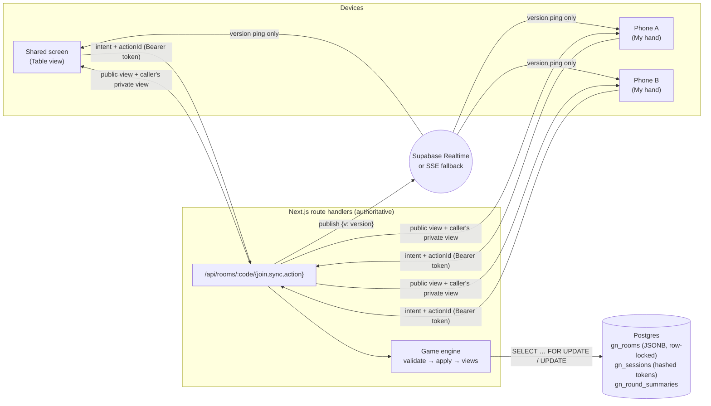

# Game Night

Host card and party games on one shared screen (laptop, TV, Fire TV Stick browser) while everyone plays from their own phone. Friends join with a six-character room code, a QR code or a link. No accounts or installs, and no betting or purchases.

- **25 fully playable games.** 10 party games: Never Have I Ever, Trivia Night, Emoji Movies, Most Likely To, Clue Rush, Majority Rules, Quick Categories, Caption Clash, Rank It, Secret Signal. 15 card games: Crazy Eights, Go Fish, Old Maid, War, Snap, Memory Match, Hearts, Spades, President, Bluff, Sevens, Golf, Higher or Lower, Twenty-One, Switch.
- **Private information stays private.** Hands, secret symbols, rankings and votes are filtered on the server. Another player's browser never receives them.
- **Scores add up across games** on a Game Night leaderboard for the whole room.
- **Real-time and resilient.** Players can reconnect after a refresh or a network drop. The host role moves automatically if the host disappears. Turn and round timers are built in, and the computer plays for anyone who's away.
- **Built for pregaming.** Spicy adults-only content is on by default (After Dark trivia, spicy would-you-rather, cheeky Most Likely To prompts). Never Have I Ever works as a drinking game, and an optional **Sip mode** house rule turns the other party games into drinking games. A Kahoot-style leaderboard with rank changes and 🔥 answer streaks appears after every round.
- **Party extras.** Team mode (Trivia, Emoji Movies, Spades, Clue Rush), bots, spectators, rematch, and switching games without a new room. The family-friendly text filter is off by default and hosts can switch it on.

Full rules for every game: [GAME_RULES.md](./GAME_RULES.md) (also shown in the app at `/rules`).

---

## Play on your Mac with phones (same Wi-Fi)

```bash
git clone https://github.com/AyushKishor/Game-Night.git
cd Game-Night
npm install
npm run party        # builds, then prints the address to open
```

Open the address it prints (for example `http://192.168.1.23:3000`) on the Mac and click **Host a game**. Everyone scans the QR code with their phone. If you open `http://localhost:3000` instead, the app swaps in your Mac's Wi-Fi address for the QR code, since phones can't reach "localhost". Phones must be on the same Wi-Fi as the Mac. If macOS asks whether to allow incoming connections, click **Allow**.

For development with live reload, use `npm run dev` (it also listens on your Wi-Fi address).

**Phones can't open the link?**

- Check they're on the **same Wi-Fi** as the Mac. Guest networks and mobile data won't work, and some routers block devices from seeing each other ("client isolation").
- Look at the list `npm run party` prints and try the other addresses, or `http://<your-mac-name>.local:3000` on iPhones.
- macOS firewall (System Settings → Network → Firewall) must allow incoming connections for Node.
- **Easiest fix: `npm run party:online`.** It builds, starts the app and creates a free temporary public link (`https://something.trycloudflare.com`) that works on any network, including mobile data and a Fire TV. The link changes each time and stops when you press Control+C.

## Try it in 5 minutes (get a URL for your TV)

The fastest way to get a public URL is **Render's free tier**. It runs one long-lived Node server, so no database is needed (rooms live in memory and reset when the service restarts).

1. Sign in at <https://render.com> with GitHub.
2. **New → Blueprint** → pick the `Game-Night` repository (branch `main`). Render reads `render.yaml` at the repo root.
3. Click **Apply** and wait for the build (about 3–5 minutes). You get `https://game-night-xxxx.onrender.com`.
4. On the Fire TV, open **Silk Browser** (or Firefox), type the URL, and click **Host a game**. The TV becomes the table.
5. On your phone, scan the QR code on the TV. As the host, you can also press **Play from my phone** to move your own hand onto your phone.

> Free Render services sleep after ~15 minutes idle; the first visit then takes ~30 s to wake up.

For a production setup with persistence and multiple instances, use **Vercel + Supabase** ([below](#deploying-to-vercel--supabase)).

---

## Features

| Area          | What's included                                                                                                                                                                                                     |
| ------------- | ------------------------------------------------------------------------------------------------------------------------------------------------------------------------------------------------------------------- |
| Rooms         | 6-character codes (no look-alike characters), QR code, share link, lock room, capacity (12 players + 20 spectators), spectators, idle expiry                                                                        |
| Players       | Nicknames with duplicate handling (`Sam`, `Sam 2`), avatars, ready status, host removes players, host transfer, leave, bots                                                                                         |
| Games         | 31 games (incl. Tycoon, Property Deal, Colour Clash, Power Grab, Code Words and Texas Hold'em), presets (Quick / Standard / Long), only relevant settings shown, house rules, rematch, change game, return to lobby |
| Real time     | Server-authoritative engine, version pings over Supabase Realtime or Server-Sent Events, polling fallback, timer wake-ups                                                                                           |
| Reliability   | Reconnect by token, idempotent action IDs, row-locked mutations, stale-action rejection, autopilot for away players                                                                                                 |
| Screens       | Shared **Table** view (public info only) and personal **My hand** view; one-time "continue on my phone" handoff link                                                                                                |
| Accessibility | Keyboard / D-pad navigation, visible focus, screen-reader labels, reduced motion, reduced sensory mode, high-contrast 4-colour cards, text labels next to icons, large touch targets                                |
| Sound         | Synthesised Web Audio cues (join, deal, your turn, timer warning, correct, round end, victory); muted until first interaction; mute + volume                                                                        |

---

## Technology choices

- **Next.js 16 (App Router), React 19, TypeScript (strict)**
- **Tailwind CSS v4**, **shadcn/ui-style components** (Radix primitives), **Lucide** icons, **Framer Motion**
- **Zustand** for client state, **Zod** for every network payload and all content files
- **Postgres** (Supabase in production) via the `postgres` driver, **Supabase Realtime Broadcast** for push updates
- **Vitest** (unit, simulation and integration tests), **Playwright** (end-to-end), ESLint, Prettier

### Why this architecture

The brief preferred Supabase + Vercel, and it also required an **authoritative server with truly private state**. Game rules therefore run in **Next.js route handlers** (the server). Supabase provides **Postgres** (storage, row locks) and **Realtime** (push). Clients never talk to the database:

- Every table has **Row Level Security enabled with no policies** for `anon`/`authenticated`, and default grants are revoked. The browser can't read game data through the Supabase API at all.
- Realtime messages carry **only a version number**. Each client then fetches **its own filtered view** over an authenticated request. A subscriber therefore learns nothing it shouldn't.

This keeps one coherent stack (no separate Socket.IO server) that deploys on Vercel serverless functions.



---

## Local setup

Requirements: Node.js ≥ 20.9 (22 recommended), npm. Postgres is optional.

```bash
git clone https://github.com/AyushKishor/Game-Night.git
cd Game-Night
npm install
cp .env.example .env.local      # optional: leave DATABASE_URL empty for the in-memory store
npm run dev                      # http://localhost:3000 (also reachable from phones on your Wi-Fi)
```

To test with phones on your Wi-Fi, run `npm run dev -- -H 0.0.0.0` and open `http://<your-computer's-LAN-IP>:3000` on the phone. The QR code uses whatever address the host screen was opened with.

### With a local Postgres

```bash
createdb gamenight
echo 'DATABASE_URL=postgres://localhost:5432/gamenight' >> .env.local
npm run db:migrate
npm run db:seed        # validates content; no rows needed
npm run dev
```

### Environment variables

| Variable                                                    | Required             | Purpose                                                                            |
| ----------------------------------------------------------- | -------------------- | ---------------------------------------------------------------------------------- |
| `DATABASE_URL`                                              | Production on Vercel | Postgres connection string. Empty uses the in-memory store (single server only).   |
| `SUPABASE_URL`, `SUPABASE_SERVICE_ROLE_KEY`                 | Optional             | Server-side Realtime broadcast. The service role key must never reach the browser. |
| `NEXT_PUBLIC_SUPABASE_URL`, `NEXT_PUBLIC_SUPABASE_ANON_KEY` | Optional             | Browser subscribes to Realtime (anon key only; RLS blocks data access).            |
| `CRON_SECRET`                                               | Recommended          | Protects `/api/cron/cleanup`.                                                      |
| `ROOM_IDLE_MINUTES`                                         | No (180)             | Rooms expire after this much inactivity.                                           |
| `SESSION_TTL_HOURS`                                         | No (24)              | Guest session lifetime.                                                            |
| `BOT_DELAY_MS`                                              | No (1200)            | Pause between computer moves.                                                      |
| `DATABASE_POOL_MAX`                                         | No (5)               | Connections per instance.                                                          |

## Database

Schema and migrations live in `supabase/migrations/` (plain SQL, compatible with `supabase db push`).

- `gn_rooms`: one row per room. `doc` JSONB holds the full server-side state, including secrets. `code` is unique and `active_at` drives expiry.
- `gn_sessions`: SHA-256 hashes of guest bearer tokens, with an expiry.
- `gn_round_summaries`: completed round summaries (public info).
- `gn_cleanup_idle_rooms(interval)`: SQL helper for scheduling with `pg_cron`.

`npm run db:migrate` applies pending files and records them in `gn_schema_migrations`. It's idempotent.

## Testing

```bash
npm run typecheck      # tsc --noEmit (strict)
npm run lint           # ESLint
npm test               # Vitest: 190+ tests
npm run build          # production build
npm run test:e2e       # Playwright (starts `next start` on port 3200)
TEST_DATABASE_URL=postgres://…/gamenight_test npm test   # also runs the Postgres integration suite
```

What's covered:

- **Deck utilities**: creation, deterministic and roughly uniform shuffling, dealing, drawing, recycling, comparison, sorting.
- **Every game** (`tests/unit/all-games.test.ts`): a complete simulated match at minimum, typical and maximum player counts, for the Quick and Standard presets. At every step it asserts that no player's secret cards appear in the public view or in another player's view. It also checks consistent standings, tie handling, serialisable views, malformed-action rejection and determinism.
- **Rules per game** (`tests/unit/game-rules.test.ts`, `crazy-eights.test.ts`): legal and illegal moves, turn progression, scoring, shooting the moon, bids and bags, war ties, snap races, timers, anonymised voting, hidden rankings, team pooling.
- **Room service** (`tests/unit/rooms.test.ts`): create and join, duplicate names, bad names, unknown and expired codes, cleanup, host-only commands, readiness, private-hand filtering, out-of-turn rejection, duplicate action IDs, concurrent actions, reconnect, bad tokens, host transfer, autopilot for disconnected players, kick, lock, capacity, spectators, a full bot game with leaderboard points, rematch, game switching and device handoff.
- **Postgres** (`tests/unit/postgres.test.ts`): persistence, a second instance seeing the same state, row-lock serialisation of three simultaneous actions, idle cleanup.
- **End to end** (`tests/e2e`): invalid codes; host plus 4 players joining, ready and starting; cards never appearing on the table or other phones; reconnect after reload; switching games and finishing a round; a full game against bots with leaderboard and rematch; host transfer.

## Deploying to Vercel + Supabase

1. **Supabase**: create a project. Under **Project Settings → Database → Connection string → Transaction pooler**, copy the URI (port 6543).
2. Apply the schema, either with `DATABASE_URL=<that URI> npm run db:migrate` from the repo folder, or by pasting `supabase/migrations/*.sql` into the SQL editor.
3. (Optional, for instant updates) In **Project Settings → API**, copy the project URL, the `anon` key and the `service_role` key.
4. **Vercel**: **Add New → Project** → import the `Game-Night` repo (no root directory change needed).
5. Add environment variables: `DATABASE_URL`, `CRON_SECRET` (any long random string), and optionally `SUPABASE_URL`, `SUPABASE_SERVICE_ROLE_KEY`, `NEXT_PUBLIC_SUPABASE_URL`, `NEXT_PUBLIC_SUPABASE_ANON_KEY`.
6. Deploy. `vercel.json` schedules `/api/cron/cleanup` hourly to remove idle rooms. Vercel sends `Authorization: Bearer $CRON_SECRET` automatically.

Without the Supabase Realtime variables everything still works: clients poll every ~2.5 s.

## Real-time model

1. A client sends an **intention** (`POST /api/rooms/:code/action` with `{ kind, actionId, … }` and its bearer token).
2. The server loads the room with `SELECT … FOR UPDATE`, so concurrent actions queue per room. It runs maintenance (expiry, presence, host transfer, due timers, bot moves), validates the action with Zod and the game's `validate`, then applies it with the pure `apply`.
3. It bumps `version`, persists, and publishes `{ v: version }`.
4. Every client that receives a newer version calls `POST /sync` and gets **the public view plus only its own private view**.
5. Timers need no background workers: every snapshot includes `wakeAt`, and clients call `/sync` at that moment. The server resolves expired timers idempotently.

### Public vs private state

Each game module implements `publicView(state)` and `privateView(state, playerId)`. The server builds a snapshot per caller, so hands, deck order, secret symbols, rankers' orders, votes before reveal, Clue Rush words and the dealer's hole card never leave the server for the wrong player. There's no reliance on CSS hiding. Spectators and the shared screen get no private view.

## Security & threat model

| Threat                              | Mitigation                                                                                                                                          |
| ----------------------------------- | --------------------------------------------------------------------------------------------------------------------------------------------------- |
| Reading other players' cards        | Server-side view filtering; RLS with no policies; realtime carries no data; tests assert no leakage at every simulated step                         |
| Forged or out-of-turn moves         | Server validates every action against game state; clients send intentions only                                                                      |
| Replayed / double-submitted actions | Idempotent `actionId`s (last 300 per room)                                                                                                          |
| Race conditions                     | Row lock per room (`FOR UPDATE`) in Postgres; synchronous critical section in memory; stale snaps rejected via `seen` counters                      |
| Session theft / guessing            | 256-bit random tokens, only SHA-256 hashes stored, 24 h expiry; removed players' sessions deleted                                                   |
| Room enumeration                    | 31⁶ ≈ 887M codes, rate-limited preview/join, rooms expire, host can lock                                                                            |
| Abuse / spam                        | Rate limits per IP/token (create, join, actions, sync); length limits; control, zero-width and bidi characters stripped; optional block-list filter |
| XSS                                 | User text is only rendered as React text (never `dangerouslySetInnerHTML`)                                                                          |
| Secret leakage                      | Service role key is server-only; `.env*` git-ignored; `.env.example` has no values                                                                  |

The rate limiter is in-memory per instance. For strict global limits across many serverless instances, back it with Redis or Vercel KV.

## Adding a game

1. Create `src/games/<id>/index.ts` exporting a `GameModule` (see `src/lib/engine/types.ts`): metadata and rules, relevant `settings`, `presets`, a Zod `actionSchema`, and `setup`, `validate`, `apply`, `pending`, `deadline`, `onTimeout`, `botAction`, `isOver`, `results`, `roundSummaries`, `publicView`, `privateView`. Reuse `src/lib/engine/cards.ts`, `games/shared/*` (shedding, tricks, quiz, party helpers) and `helpers.ts`.
2. Register it in `src/games/index.ts`.
3. Add a view in `src/components/game/` using the kit (`HandPicker`, `ChoiceGrid`, `PromptHeader`, `RoundReveal`, `Seats`, `Countdown`) and map it in `registry.tsx`.
4. The generic simulation test picks it up automatically. Add rule-specific tests, then run `npm run rules:generate`.

To stage an unfinished game, list it in `COMING_SOON` in `src/games/index.ts`. It then shows as "Coming soon" and can't be started.

## Content

All prompts are original and stored as JSON in `src/content/`, validated with Zod at startup:

| File                        | Items                                                |
| --------------------------- | ---------------------------------------------------- |
| `quick-categories.json`     | 108 categories + letters                             |
| `majority-rules.json`       | 102 questions                                        |
| `rank-it.json`              | 101 prompt sets × 5 items                            |
| `caption-clash.json`        | 102 scenarios                                        |
| `trivia.json`               | 148 questions, 3 difficulty levels                   |
| `trivia-after-dark.json`    | 81 adults-only questions (drinks, nightlife, dating) |
| `never-have-i-ever.json`    | 100 prompts                                          |
| `majority-rules-spicy.json` | 60 spicy would-you-rather questions                  |
| `emoji-movies.json`         | 86 emoji puzzles (films and phrases)                 |
| `most-likely.json`          | 100 spicy + 45 milder prompts                        |
| `clue-rush.json`            | 120 word cards with forbidden words                  |
| `secret-signal.json`        | 40 symbols with bot hints                            |
| `moderation.json`           | optional word filter                                 |

Emoji Movies and some trivia answers mention well-known film titles as factual answers; no artwork, logos or quotes are used.

## Sound

`src/lib/client/sound.ts` synthesises every effect with Web Audio, so no audio files or licences are involved. To use recorded sounds, put permissively licensed files in `public/sounds/` and map them in `SAMPLE_FILES`. The audio context is created only after the first tap or key press (no autoplay).

## Known limitations

- The in-memory store (no `DATABASE_URL`) suits one long-running server only. On Vercel serverless you **must** set `DATABASE_URL`.
- Rate limiting is per instance.
- Without Supabase Realtime on Vercel, updates arrive by polling (~2.5 s). Server-Sent Events only work on a single long-running server.
- Bots are simple heuristics. Clue Rush and free-text party games need real people to be fun: bots pass or use canned captions and clues.
- Quick Categories validity is decided by player votes, not a dictionary.
- Sounds are synthesised tones, not recorded effects.

## Future improvements

- Redis-backed global rate limiting and presence.
- More languages and content packs, including a host-editable custom prompt pack.
- Drawing games (canvas) and buzzer-style trivia.
- Persistent optional accounts for all-time stats.
- Richer bot strategies (card counting in Hearts/Spades, smarter Go Fish memory).
